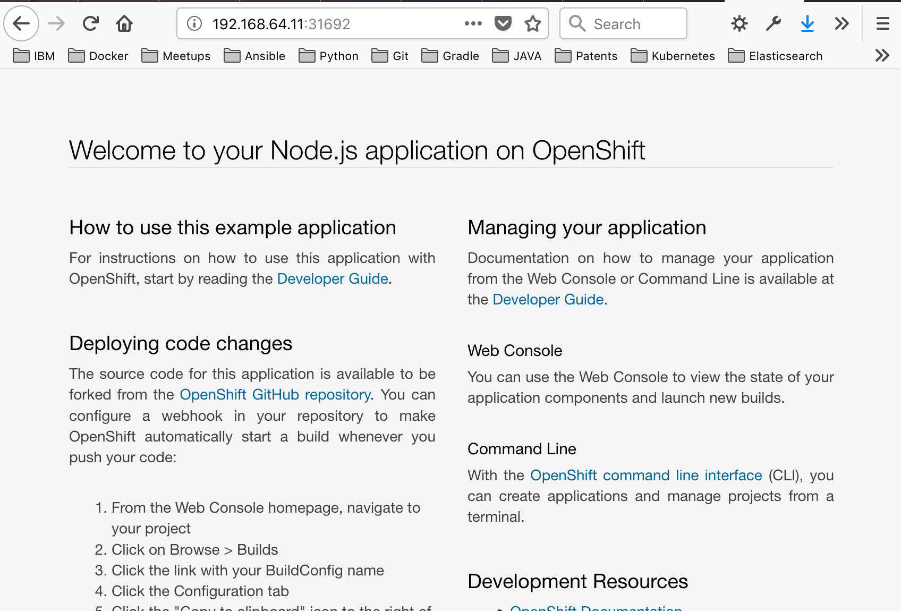

# 4. OpenShiftアプリケーションの公開

[前のLab（Lab3）](../Lab3/README-ja.md) の指示に従ってアプリケーションが稼働していることを確認したら、次のステップは、クラスター外のアプリケーションのアクセスを構成することです。 これを行うには、いくつかの方法があります。

- Node-port services
- Port-forwarding
- Routes

## 4.1 Node port services

This is the cleanest way to access the applications outside of OpenShift environment both locally and publicly. This way essentially makes use of the cluster node's IPs and a port in between the range (30000-32767) and tells OpenShift to proxy to the underlying application via. the port. This is better than the next two solutions for several reasons: we don't have to worry about port clashes, this works for non HTTP based services and finally, does not require a public host name. 
これは、OpenShift環境外のアプリケーションにローカルおよびパブリックの両方でアクセスする最もクリーンな方法です。 この方法は、本質的に、クラスターノードのIPと範囲（30000〜32767）の間のポートを利用し、OpenShiftはこのポートを介して基になるアプリケーションにプロキシするように指示されます。これはいくつかの理由で次の2つのソリューションよりも優れています。ポートの衝突を心配する必要はありません。これは非HTTPベースのサービスで機能し、パブリックホスト名を必要としません。

NodePortを介してデプロイを公開するには _load balancer_type でデプロイを公開し、 _nodejs-ex-ingress_ という名前でラベルを付けます:
```console
$ oc expose dc nodejs-ex --type=LoadBalancer --name=nodejs-ex-ingress
service/nodejs-ex-ingress exposed
```

作成されたNodePortを確認するには、次を実行します:
```console
$ oc get --export svc nodejs-ex-ingress
NAME                TYPE           CLUSTER-IP   EXTERNAL-IP    PORT(S)          AGE
nodejs-ex-ingress   LoadBalancer   <none>       172.29.51.89   8080:31692/TCP   <unknown>
```

NodePortは、次のコマンドで見つけることができるクラスターの内部または外部IPと組み合わせて使用できます:
```console
$ oc get node -o wide
NAME        STATUS    ROLES     AGE       VERSION           INTERNAL-IP     EXTERNAL-IP   OS-IMAGE                KERNEL-VERSION              CONTAINER-RUNTIME
localhost   Ready     <none>    13h       v1.11.0+d4cacc0   192.168.64.11   <none>        CentOS Linux 7 (Core)   3.10.0-957.5.1.el7.x86_64   docker://1.13.1
```

これによりブラウザでアプリケーションにアクセスできるようになりました。 この例では `192.168.64.11：31692` のNodeアプリケーションにアクセスできます:



## 4.2 Port-forwarding

あるいは、クラスターの特定のポッドのポートにすばやくアクセスする場合は、oc `port-forward` コマンドを使用することもできます:

```
$ oc port-forward POD [LOCAL_PORT:]REMOTE_PORT
```

## 4.3 Routes

Webアプリケーションの場合、最も一般的な公開方法はRoutesです。 Routesは、サービスをホスト名として公開します。 これを行うには、使用可能なホスト名がある場合にコマンドを実行します:

```
$ oc expose svc/nodejs-ex --hostname=www.example.com
```

おめでとうございます！ このワークショップのすべてのラボを完了しました！ 以下の方法を学びました:
- OpenShiftプロジェクトの作成
- OpenShiftアプリケーションの作成（各種方法）
- アプリケーションステータスの監視
- アプリケーションの公開とアクセス

Minishiftの操作方法の詳細については [Minishift docs](https://docs.okd.io/latest/minishift/index.html) を確認してください。
